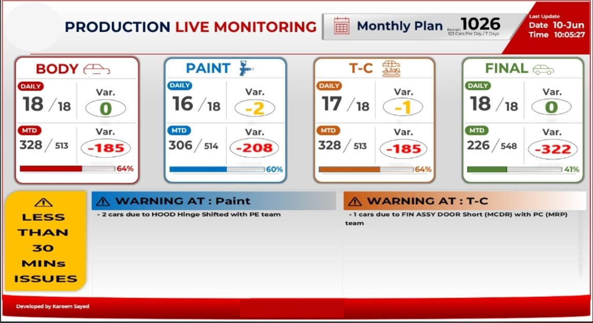

# 🏭 Production Live Monitoring System

## 📝 Overview
A real-time production tracking dashboard developed to monitor manufacturing operations across all major shop floors. Designed with Modern UI and Flat Design principles, this system provides management with instant visibility into actual production volumes versus planned targets, ensuring rapid response to operational bottlenecks.

## 🚀 Key Features
* **Real-Time Shop Tracking:** Monitors actual production data across critical stages including Body Out, Paint, Trim & Chassis (T-C), and Final assembly.
* **Plan vs. Actual Variance:** Automatically calculates and visually highlights the daily and Month-to-Date (MTD) variance to keep production on track.
* **Automated Warning System:** Features a dynamic alert banner that identifies specific issues causing delays (e.g., specific part shortages or quality holds) in real-time.

## 🛠️ Tech Stack & Architecture
* **Frontend/Visualization:** Modern Excel UI leveraging Flat Design, Dark Mode principles, and complex Dynamic Array Formulas (`=LET`, `=MAP`, `=LAMBDA`) for real-time alert generation without VBA overhead on the UI.
* **Backend/Data Processing:** Advanced Excel VBA functioning as an asynchronous backend engine.
* **Smart Schedulers:** Custom built `Application.OnTime` loops running 24/7 in the background:
  * **Master Plan Fetcher:** Syncs with the control center every 5 minutes.
  * **Heavy Data Import:** Runs every 10 minutes using `Scripting.Dictionary` and Memory Arrays to process thousands of rows seamlessly.
  * **Andon Blinker:** A 2-minute cycle engine that recalculates operational bottlenecks and statically updates visual warning indicators based on variance limits.

---
*Developed to bridge the gap between production planning targets and actual shop-floor execution.*
